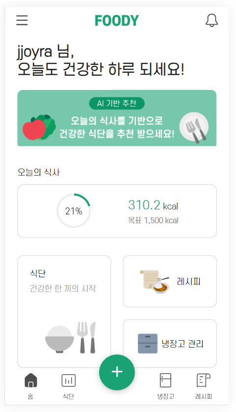
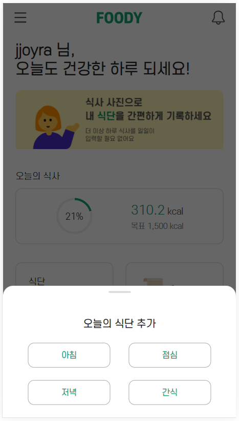
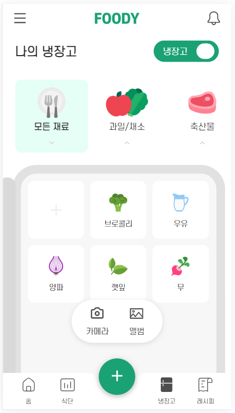
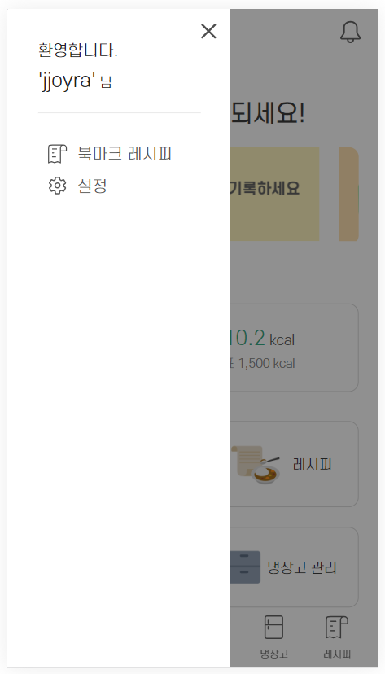
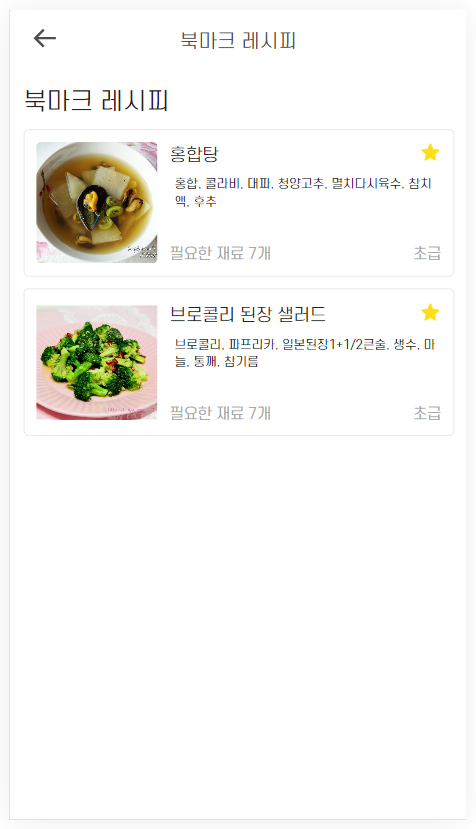

# 🥦FOODY🥦

<div align=center>
2023.08.28 ~ 2023.10.06(6주)
</div>

## 🍎서비스 소개🍎

<div align=center>


사용자의 부족 영양소를 분석하여 맞춤 식단(음식)을 추천해 주는 서비스

사용자의 입맛을 분석하여 맞춤 음식을 추천해주는 서비스

냉장고 재료를 분석하여 냉장고 재료를 활용할 수 있는 음식 레시피 제공 서비스

</div>

## 프로젝트와 관련한 개인 Blog입니다.
제가 프로젝트를 진행하면서 겪었던 문제와 고민을 해결하였던 과정을 구체적으로 서술하기 위해 노력했습니다. 
<a href="https://siino.tistory.com/category/%ED%94%84%EB%A1%9C%EC%A0%9D%ED%8A%B8">블로그에서 자세히 알아보기</a>


## 🍎주요 기능🍎

    - 사용자의 식사를 AI 기술을 활용하여 사진으로 음식과 영양소를 분석
    - 일일 섭취 권장 영양소 대비 부족한 영양소에 대한 정보 제공
    - 사용자 취향과 부족 영양소에 대한 지표를 기준으로 식사 추천
    - 소유하고 있는 냉장고 재료와 부족 영양소에 기반한 추천
    - 유사한 다른 유저, 선호도를 종합한 추천하기 위한 다양한 알고리즘
    - OCR 기술을 통해 구매한 음식 재료에 대해 냉장고 현황 현실화

## 🍎기술 특이점🍎

    - OCR 기술 활용한 영수증 인식 및 카테고리화
    - 이미지 분류 인공지능 모델인 YOLO모델에 추가학습을 진행하여 음식 사진 인식 및 분석
    - 10만개 이상의 비정형 음식데이터 가공
    - 사용자의 선호도(취향)에 맞는 음식 추천 및 추천 로직 최적화
    - 비정형 레시피 데이터의 전처리 Flask서버, FastAPI 서버를 이용한 yolo와 빅데이터 추천 시스템 분리
    - Redis를 활용한 검색어 자동완성 기능 최적화

## 🍎주요 화면🍎

|                                                |                                                         |
| :--------------------------------------------: | :-----------------------------------------------------: |
|     |                        |
|                   메인페이지                   |                       탭바 + 버튼                       |
|  |               |
|                   식단페이지                   |                        식단 등록                        |
|             |               |
|                 냉장고 페이지                  |                        재료 등록                        |
|    |  |
|               레시피 추천 페이지               |                     레시피 상세보기                     |
|     |                      |
|                   마이페이지                   |                         북마크                          |

[**> 화면 GIF 보러가기 <**](./exec/UI/UI.md)

## 🍅시스템 아키텍쳐🍅


## 🍅ERD🍅


## 🍅추가 산출물🍅

- [요구사항 명세서](./exec/requirements/requirements.md)
- [와이어 프레임](./exec/wireframe/wireframe.md)

<!--  -->

## 🥑Commit Convention🥑

```jsx
// 작업 종류
init: 프로젝트 셋팅
feat: 새로운 기능 추가할 경우
fix: 버그를 고친 경우
docs: 문서를 수정한 경우(ex. Swagger, README)
style: 코드 포맷팅, 세미콜론 누락, 코드 변경이 없는 경우
refactor: 코드 리팩토링
test: 테스트 코드, 리팩토링 테스트 코드 추가
chore: 빌드 업무 수정, 패키지 매니저 수정(ex. dependency 추가)
merge: 충돌 시 merge할 경우

// 예시
feat: 로그인 API 구현
```

## 🥑Git Flow🥑

```jsx
# Branch명
master : 운영 서버로 배포하기 위한 branch
develop : 안정되고 배포 가능한 branch
FE/develop : frontend develop
BE/develop : backend develop
{포지션}/feat/{기능}#{이슈 번호} : 기능 개발을 위한 branch
{포지션}/refactor/{기능}#{이슈 번호} : 리팩토링 branch
{포지션}/hotfix : dev 브랜치에서 발생한 버그를 수정하는 branch

// 예시
BE/feat/user#1

# Pull Request명
브랜치명
# Pull Request 내용
템플릿
```

## 🥑Jira Convention🥑

```jsx
- 담당자, 스토리 포인트 지정 필수
- 팀원끼리 스토리 포인트 밸런스 맞추기
- 스토리 포인트 하나 당 4 넘지 않도록 할당
```

## 🥕팀원 소개🥕

<!-- |  이름  |      역할      |                         개발 내용                         |
| :----: | :------------: | :-------------------------------------------------------: |
| 신호인 | 팀장, Back-end |                YOLO 모델 학습, CI/CD 구축                 |
| 신상원 |    Back-end    | 추천 알고리즘, 빅데이터 서버 구축, 북마크/레시피/추천 API |
| 이규민 |    Back-end    |              OAuth2, 소셜 로그인, 영양소 API              |
| 조희라 |    Back-end    |        영수증 OCR, 냉장고 API 및 재료 데이터 정제         |
| 임희선 |   Front-end    |         냉장고 관리 구현, 레시피/마이페이지 구현          |
| 김승현 |   Front-end    |        회원가입/로그인/먹BTI 구현, 식단 관리 구현         | -->

<div align="center">

| [](https://github.com/signalman) | [](https://github.com/Shin-sangwon) | [](https://github.com/kkyu-min) |
| :------------------------------------------------------------------------------------------------------------: | :----------------------------------------------------------------------------------------------------------------: | :-----------------------------------------------------------------------------------------------------------: |
|                                                     신호인                                                     |                                                       신상원                                                       |                                                    이규민                                                     |
|                                                    BE, 팀장                                                    |                                                         BE                                                         |                                                      BE                                                       |

| [](https://github.com/jjoyra) | [](https://github.com/wink4u) | [](https://github.com/Im-hass) |
| :---------------------------------------------------------------------------------------------------------: | :----------------------------------------------------------------------------------------------------------: | :----------------------------------------------------------------------------------------------------------: |
|                                                   조희라                                                    |                                                    김승현                                                    |                                                    임희선                                                    |
|                                                     BE                                                      |                                                      FE                                                      |                                                      FE                                                      |

</div>

## 🥕사용 기술🥕

### FrontEnd

- `TypeScript` : 4.9.5
- `React` : 18.2.0
- `Recoil`
- `Axios`
- `styled-component`
- `ESLint`
- `Prettier`

### BackEnd

- `JAVA` : 17
- `Spring` : 2.7.15
  - `Spring Data JPA`
  - `Spring Security`
  - `Spring Rest Docs`
- `Python`
- `FastAPI`
- `MySQL`
- `Redis`

### CI/CD

- `AWS EC2`
- `Jenkins`
- `Docker` : 24.0.6, build ed223bc
- `Amazon S3`
- `NginX` : nginx/1.18.0 (Ubuntu)

### Tool

- `Git`
- `Jira`
- `Notion`
- `Mattermost`
- `Figma`
- `VS Code`
- `intellij`
